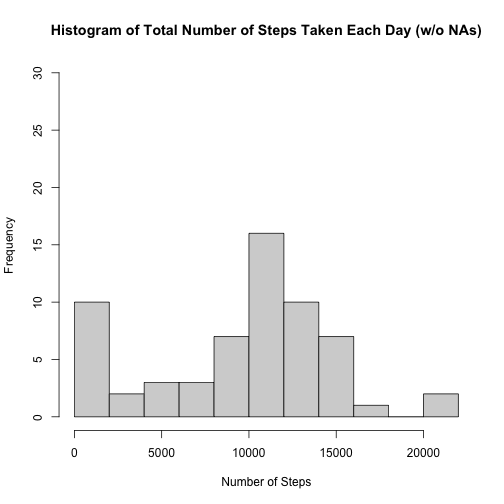
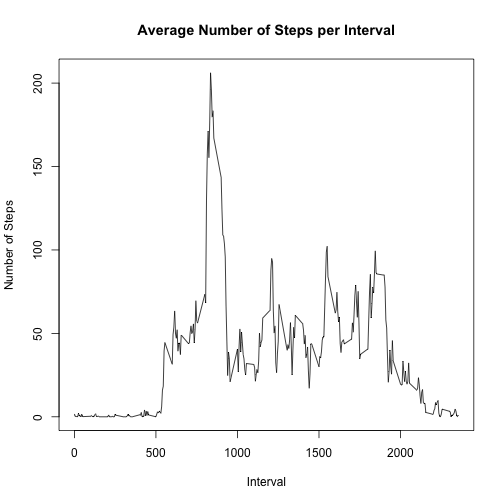
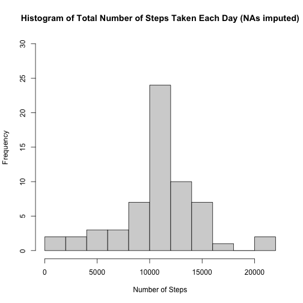
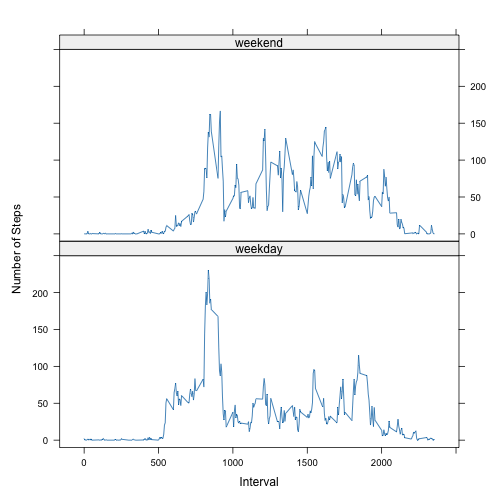

## Introduction

It is now possible to collect a large amount of data about personal movement using activity monitoring devices such as a Fitbit, Nike Fuelband or Jawbone Up. These type of devices are part of the “quantified self” movement – a group of enthusiasts who take measurements about themselves regularly to improve their health, to find patterns in their behavior, or because they are tech geeks. But these data remain under-utilized both because the raw data are hard to obtain and there is a lack of statistical methods and software for processing and interpreting the data.

This assignment makes use of data from a personal activity monitoring device. This device collects data at 5 minute intervals through out the day. The data consists of two months of data from an anonymous individual collected during the months of October and November, 2012 and include the number of steps taken in 5 minute intervals each day.

## Data Import

To import the raw data which was sourced from the course website on 27/12/2023, below code is executed. To import the data successfully, the csv file must be stored in the working directory. As the format of the date column is character, it is changed to date format.


```r
wd <- getwd()
df_activity <- read.csv(file.path(wd, "activity.csv"), header = TRUE, na.strings = "NA")
df_activity$date <- as.Date(df_activity$date, "%Y-%m-%d")
```

## Data Analysis
### Total Number of Steps
To show a histogram of the total number of steps taken each day, the imported data set is grouped by date and the sum of all intervals is taken. For the beginning, we are ignoring NA values, hence we set `na.rm = TRUE`.


```r
library(dplyr)
steps_total <- df_activity %>% 
  group_by(date) %>% 
  summarise(total_steps = sum(steps, na.rm = TRUE))
```

Once the data has been grouped, we can plot the histogram which shows the frequency distribution of the number of steps taken each day.


```r
hist(steps_total$total_steps, breaks = 10, xlab = "Number of Steps", ylim = c(0,30),
     main = "Histogram of Total Number of Steps Taken Each Day (w/o NAs)")
```




The mean and median number of steps taken each day are shown below:

```r
mean(steps_total$total_steps)
```

```
## [1] 9354.23
```

```r
median(steps_total$total_steps)
```

```
## [1] 10395
```


### Daily Activity Pattern

Next, we are showing the daily activity pattern by calculating the average of steps taken in each time interval across all days. For this, the data is grouped again, but this time by the time interval. We are still ignoring NA values.


```r
interval_avg <- df_activity %>% 
  group_by(interval) %>% 
  summarise(avg = mean(steps, na.rm = TRUE))

with(interval_avg, plot(interval, avg, xlab = "Interval", type = "l",
                        ylab = "Number of Steps",
                        main = "Average Number of Steps per Interval"))
```



The 5-minute interval that, on average, contains the maximum number of steps is calculated as per below:


```r
max_interval_idx <- which.max(interval_avg$avg)
max_interval <- as.numeric(interval_avg$interval[max_interval_idx])
print(max_interval)
```

```
## [1] 835
```

### How to Handle Missing Data
Below code gives the number of missing values in the data set.

```r
sum(is.na(df_activity$steps))
```

```
## [1] 2304
```
To deal with missing values, I decided to use the average number of the respective interval to overwrite the NA. These averages were already calculated and stored in the variable `interval_avg`. As the average number is almost always not an integer, I adjusted the decimal downward to the next integer, e.g. `3.57` is rounded to `3`.  
Instead of overwriting the existent `df_activity`, I created a copy of it called `df_activity_new`. Then, the code loops through every row and checks for NA values in the steps column. If the value is NA, the value is overwritten as described above. 


```r
df_activity_new <- df_activity
for (row in 1:nrow(df_activity_new)) {
    if(is.na(df_activity_new[row, "steps"])) {
        df_activity_new[row, "steps"] = 
          floor(as.numeric(interval_avg[interval_avg$interval == df_activity_new[row, "interval"],][2]))
    }
}
```

To show the histogram of the total number of steps taken each day after imputing missing values, the data is grouped again by date and the steps per interval are summed up. Here, it doesn't matter if `na.rm` is set to `FALSE` or `TRUE` as there are no NA values in the data anymore.  

```r
steps_total_new <- df_activity_new %>% 
  group_by(date) %>% 
  summarise(total_steps = sum(steps))

hist(steps_total_new$total_steps, breaks = 10, xlab = "Number of Steps", ylim=c(0,30),
     main = "Histogram of Total Number of Steps Taken Each Day (NAs imputed)")
```



The mean and median of the data after imputing missing values are shown below.

```r
mean(steps_total_new$total_steps)
```

```
## [1] 10749.77
```

```r
median(steps_total_new$total_steps)
```

```
## [1] 10641
```

Imputing the missing values by using the average of the specific interval increases the total daily number of steps taken, especially if the NA corresponded to an interval where the average across all days is high. Naturally, the mean and median also increased. When comparing both histograms, one can see that the frequency on the tails decreased a lot whilst the frequency of approx. 12,000 steps increased from 16 to roughly 24.

### Activity pattern on weekdays and weekends
In a last step, we are comparing the activity pattern on weekdays and weekends. For this, a new variable `df_activity_new_ext` is created which is a copy of the data after missing values have been imputed. Then, a new factor variable `day_type` is created. It is equal to "weekend" if the abbreviated weekday of the date is either "Sat" or "Sun". For all other days, it is set to "weekday".


```r
df_activity_new_ext <- df_activity_new
df_activity_new_ext <- mutate(df_activity_new_ext, 
              day_type = factor(ifelse(weekdays(df_activity_new_ext$date, abbreviate = TRUE) == "Sat" | 
                                  weekdays(df_activity_new_ext$date, abbreviate = TRUE) == "Sun",
                                  "weekend", "weekday")))
```

To show a time series plot of the average steps taken in each time interval across all days, we group the extended data by date, but also by day_type to show a comparison between weekdays and weekends.


```r
interval_avg_new <- df_activity_new_ext %>% 
  group_by(interval, day_type) %>% 
  summarise(avg = mean(steps))

library(lattice)
xyplot(avg ~ interval | day_type, data = interval_avg_new, layout = c(1, 2), type='l', xlab = "Interval",
       ylab = "Number of Steps", ylim = c(-10,250))
```



From the graph, one can see, that the activity starts earlier on weekdays than on the weekends. While the activity at night is similar, the total activity across the day is higher on weekdays than on weekends. The max interval is the same, but the activity in that peticular interval is higher on weekdays.
